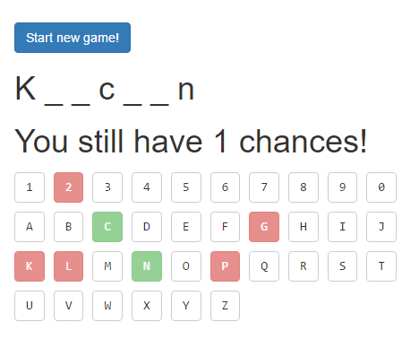

# Demo application with React + TypeScript + .NET Core + ASP.NET Core Mvc

`Work in still progress`

Next steps:
1) Show messages of Won / Lost when game ends;
2) Port to .Net Core; (DONE...)
3) Serve static files from Backend
3) Host it on Heroku;
4) Multiple strategies for Game instances storage (Redis, Mongo, InMemory)

